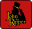

  <body style="font-family: -apple-system, BlinkMacSystemFont, 'Segoe UI'">
  
  

      
  

   
  <h1 style="text-align:center;" id="-about-"> About Me</h1>
  <blockquote style="text-align:center">
      💻 Just an average Computer Science major right now. 
       
      👨‍💻 Got interested in the concept of ethical hacking, penetration testing and red teaming. 
       
      🐱‍💻 Mainly learning on platforms like TryHackMe and HackTheBox while I work on my fundamentals. 
  </blockquote> 
   

  

      
       
  
 
   

  <h2 style="text-align:center;" id="-socials-">🔗 Socials</h2>
  

       
      
       
  
 

  <h2 style="text-align:center;" id="-achievements-">🏆 Achievements</h2>
  

      
      
      
  
 

   

  <h2 style="text-align:center;" id="-tools-">💻 Tools and Languages</h2>
  

      
      
      
      
      
      
      
      
      
      
      
      

      
  

   
  </body>
